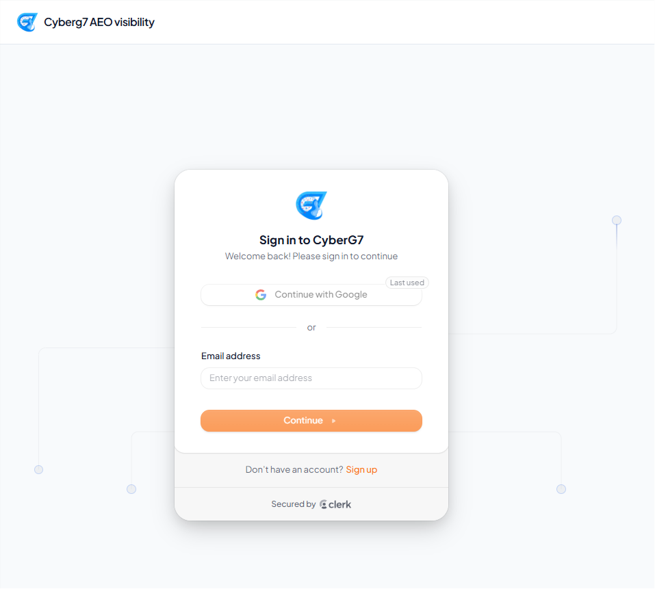
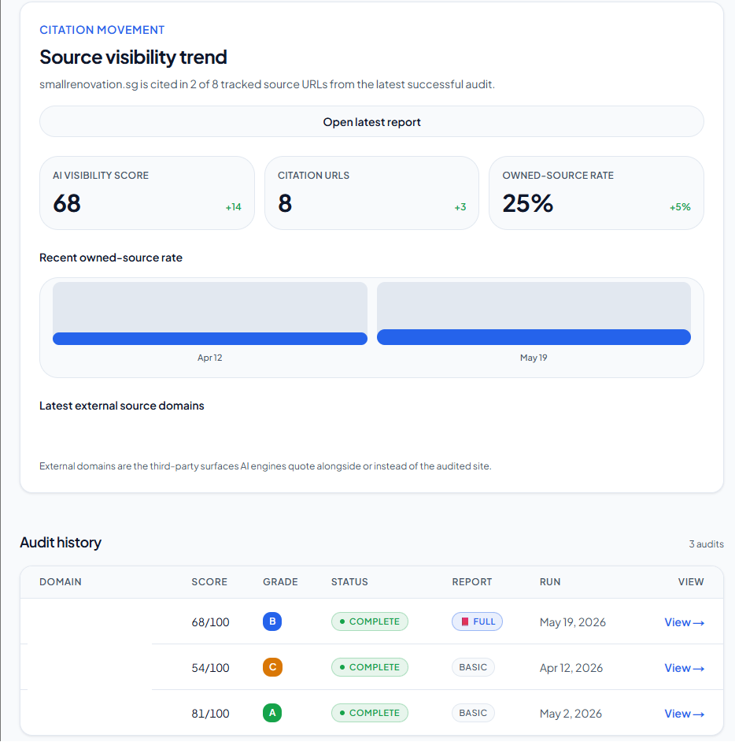
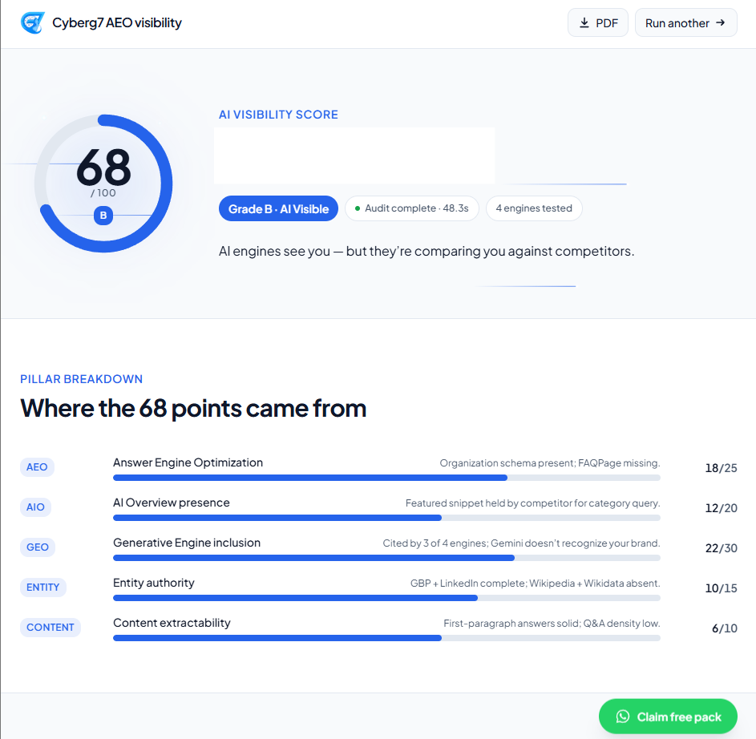

# 🔍 AI Visibility — AEO Audit SaaS

**🔗 Live site:** https://aivisibility.cyberg7.com.sg

> **A Singapore-first SaaS that audits how visible a website is to AI search engines**
> (ChatGPT · Perplexity · Gemini · Claude) and sells the fix as a 5-tier ladder.
> Production at **[aivisibility.cyberg7.com.sg](https://aivisibility.cyberg7.com.sg)**.


---

## TL;DR

**The problem.** Buyers increasingly ask an AI assistant "who's the best X in Singapore?" — and if
ChatGPT/Perplexity/Gemini/Claude name your competitors instead of you, you never even know you lost
the lead. There's no Google-Search-Console equivalent for AI answers.

**The solution.** Drop in a URL and get a live, scored audit: the app probes the four major AI engines
with realistic buyer queries, classifies each answer (recommended / cited / mentioned / not mentioned),
runs **32 static AEO/GEO checks**, and returns a 0–100 score with a graded fix list — in under 60
seconds. The free audit is the top of a **trust ladder** that converts into a Done-For-You retainer.

**Why it's interesting engineering.** The audit engine is a **pure, cached, budget-bounded pipeline**:
every external call is cost-logged to the cent, every stage has a TTL, no single failing engine can
block a result, and the whole run is held under a wall-clock and a per-audit cost ceiling.

---

## The product — a 5-tier ladder

| Tier | Price (SGD) | What |
|---|---|---|
| Free audit | S$0 | Live AI-visibility score + top fixes (the hook) |
| Paid report | S$27 | Full PDF report (generated with `@react-pdf/renderer`) |
| Report + course bundle | S$59 | Report plus the course |
| Course (lifetime) | S$47 | 8 modules, single SKU, unlocked at purchase |
| Strategy Sprint | S$500 | Founder-delivered session (loss-leader → DFY discovery) |
| Done-For-You | S$2,500/mo | The retainer — ~70% of revenue; everything above feeds it |

Pricing is **SGD-primary with a USD toggle** (every Stripe product carries two Price objects; currency
resolves by cookie pref → Vercel edge-geo fallback → weekly-cached FX).

---

## The audit engine (the core asset)

A composed pipeline under `lib/audit/` — each stage is a pure function over one shared `SiteFetch` shape:

```
 URL ─► Fetcher ─► Brand facts ─► Query matrix ─► Engines ─► Classifier ─► Score ─► Report
        (HTML,      (gpt-4o-mini   (10 buyer-      (4 AI       (YES/MENT/    (0–100,   (grade +
         JSON-LD,    extracts       intent          engines,    NO + cites,   5 pillars  fix list)
         robots,     brand facts,   archetypes)     4h cache,   24h cache)    + grade)
         sitemap,    30d cache)                     retry+backoff)
         llms.txt)                          └──────────── 32 static checks ───────────┘
                                            (AEO·AIO·GEO·ENTITY·CONTENT, pure, degrade w/o SerpAPI)
```

1. **Fetcher** — one URL → `SiteFetch` (HTML, JSON-LD, headings, meta, robots.txt, sitemap.xml, llms.txt). 2.5 MB cap, 12 s timeout, **never throws** (errors flow into `errors[]`); all downstream code consumes this single shape.
2. **Brand facts** — `gpt-4o-mini` extracts `{brand, industry, city, pain_point, segment, use_case, top_competitor}`; cached 30 d.
3. **Query matrix** — 10 buyer-intent archetypes built from brand facts; each names which engines run it.
4. **Engines** — `perplexity / openai / gemini / claude`, uniform `EngineResponse`, 4 h cache, retry-with-backoff, 30 s timeout each; a dead engine returns `null` and never blocks the run.
5. **Classifier** — `gpt-4o-mini` scores each response into `{verdict, framing, competitors_cited, citation_url_matched, score}`. `citation_url_matched` is **deterministic** (domain-in-citation), not LLM-guessed; cached 24 h.
6. **Static checks** — 32 pure checks across 5 pillars summing to 100.
7. **Scoring + behaviour** — grade bands + a verdict-driven behaviour state machine.
8. **Orchestrator** — wires it end-to-end, target **< 60 s** wall clock.

### Scoring model

| Pillar | Points |
|---|---|
| GEO (generative-engine optimization) | 30 |
| AEO (answer-engine optimization) | 25 |
| AIO | 20 |
| Entity | 15 |
| Content | 10 |
| **Total** | **100** |

**Grades:** A ≥ 80 · B ≥ 65 · C ≥ 50 · D ≥ 35 · F < 35.
**Behaviour state machine:** `recommended → compared → cited → mentioned → not_mentioned`, combining the
static score with live verdict tallies (not score-only).

---

## Cross-cutting infrastructure (Day-1 invariants)

- **Cost logger** (`lib/cost/logger.ts`) — logs **every** external API call (provider, model, tokens, USD cost, cache_hit, audit_id) to an `api_calls` table; cache hits log too with cost 0. Without it, margin on the low-priced tiers is invisible.
- **Cache** (`lib/cache/audit-cache.ts`) — sha256-keyed TTLs: brand facts 30 d · classifier 24 h · engine probes 4 h.
- **Tier access** (`lib/auth/tiers.ts`) — rank hierarchy `free(0) < paid_report(1) < course_lifetime(2) < bundle(3) < strategy_sprint(4) < dfy(5)`; `hasAccess()` compares **rank**, so the bundle correctly outranks report-or-course alone.
- **Currency** (`lib/currency/`) — SGD↔USD with cookie pref, edge-geo fallback (SG/MY/ID/TH/PH/VN → SGD), weekly FX cache.

**Enforced budgets:** free audit < **$0.15** USD · paid report < **$0.30** · DFY weekly tracking < **$0.50/wk/client**; audit wall-clock < 60 s typical, < 90 s worst case. A budget exceeded > 7 days is treated as a regression.

---

## Tech stack

- **Next.js 16** (App Router) · **React 19** · **TypeScript** (strict)
- **Tailwind 4** · Radix UI + `class-variance-authority` (shadcn-style) · `framer-motion` · `lucide-react`
- **Clerk** — authentication
- **Supabase** — Postgres + Storage + RLS (`@supabase/ssr`); migrations via `pg` + `tsx scripts/db-push.ts`
- **Stripe** — dual-currency billing · **Inngest** — async audit jobs · **Zod** — validation
- **cheerio** — fetch/parse · **next-mdx-remote** + rehype/remark — the `/blog` engine · **@react-pdf/renderer** — paid-report PDFs
- **Testing:** Vitest (+ v8 coverage) · Playwright (e2e) · Testing Library · **MSW** (mocked engine APIs) · happy-dom
- **Deploy:** Vercel · pnpm workspace

---

## Project structure

```
ai-visibility/                          # repo root
├── CLAUDE.md                           # agent guidance + architecture spec
├── ai-visibility-master-plan-v3.1…md   # authoritative product/pricing plan
├── weeks-1-6-claude-code-prompts.md    # week-by-week build prompts (acceptance criteria)
├── marketing-copy-pack.md · seo-content-strategy.md · m10-content-engine-plan.md
└── ai-visibility/                      # ⭐ the Next.js application (pnpm workspace)
    ├── app/                            #   App Router routes (audit flow, /blog, dashboard)
    ├── components/                     #   UI (Radix + CVA + framer-motion)
    ├── lib/
    │   ├── audit/                      #   ⭐ the audit engine (fetcher → orchestrator)
    │   │   ├── engines/{perplexity,openai,gemini,claude}.ts
    │   │   └── checks/{aeo,aio,geo_static,entity,content}.ts
    │   ├── cost/ · cache/ · auth/ · currency/ · blog/
    ├── supabase/                       #   schema + RLS (PLpgSQL)
    ├── n8n-workflows/                  #   M10 content pipelines (draft/distribution/newsletter)
    ├── prompts/ · scripts/ · tests/    #   prompts, db-push, e2e
    └── next.config.ts · vercel.json · vitest.config.ts · playwright.config.ts
```

---

## Getting started

```bash
cd ai-visibility            # the app lives in the subfolder
pnpm install
cp .env.local.example .env.local   # fill Clerk, Supabase, Stripe, engine API keys

pnpm dev                    # http://localhost:3000
pnpm inngest:dev            # local Inngest dev server (async audit jobs)
pnpm db:push                # apply schema to Supabase (tsx scripts/db-push.ts)
```

**Quality gates**

```bash
pnpm typecheck              # tsc --noEmit (strict)
pnpm lint                   # eslint (next config)
pnpm test                   # Vitest unit/integration (engines mocked via MSW)
pnpm test:coverage          # v8 coverage
pnpm test:e2e               # Playwright
pnpm smoke:fetcher          # live fetcher smoke test (RUN_LIVE_FETCHER=1)
```

---

## `/blog` content engine (M10)

A live editorial pipeline: **n8n draft-pipeline → Airtable drafts → Next.js `/blog/[slug]`** (MDX).
Enforced at three layers — the n8n system prompt, a render-time `clean-mdx.ts` stripper (tested), and
operator review (`briefing → drafting → review → ready → published`). House rules: no AI-authorship
tells, a fixed editorial byline, E-E-A-T methodology disclosure, and auto-populated internal links
(≥ 2 real `/blog/<slug>` links per article, never placeholder markers).

---

## Engineering highlights

- **Failure-isolated fan-out** — four AI engines probed concurrently; any one timing out returns `null` instead of failing the audit.
- **Determinism where it matters** — citation matching is a domain check, not an LLM guess, so scores are reproducible.
- **Cost as a first-class metric** — every call (cache hits included) is logged to the cent, making per-tier margin observable from Day 1.
- **Closed, rank-based tier model** — a CHECK-constrained enum + rank comparison prevents access-control drift as tiers evolve.
- **Tax-deferred by design** — Stripe `automatic_tax` is deliberately off until GST registration (S$1M turnover); a documented, intentional constraint rather than an oversight.

---

## Status & limitations

- **Live in production** ([aivisibility.cyberg7.com.sg](https://aivisibility.cyberg7.com.sg)); launched May 2026.
- MVP scope is deliberately bounded — DFY is a single tier, the course is a single SKU; Authority/Enterprise tiers are reserved for a later version.
- Several launch parameters (entity type, first launch industries) are tracked as open items and must not be defaulted silently.
- The root `CLAUDE.md` still carries an early "pre-build" note that predates the now-built app — treat the running code + `package.json` as the source of truth.

---

## Ownership

Internal **CyberG7** product — built and maintained by [@Cyberg7tech](https://github.com/Cyberg7tech).
All rights reserved. Not open for external contributions; issues and questions welcome.


## 📸 Screenshots








